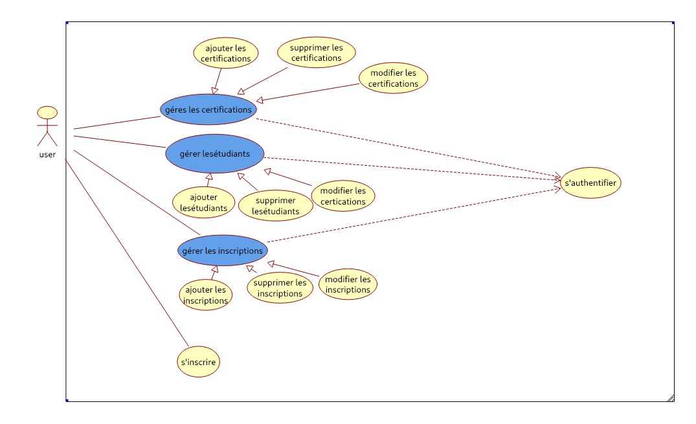

# Gestion des Inscriptions aux Certifications
##  Contexte
Dans le cadre de la digitalisation des établissements de formation, ce projet vise à développer une application permettant 
de gérer efficacement les certifications professionnelles ainsi que les inscriptions des étudiants aux différentes certifications proposées.

##  Problématique
La gestion manuelle des inscriptions aux certifications entraîne :

   -- des risques d'erreurs,
   -- une perte de temps,
   -- une difficulté dans la recherche et le suivi des étudiants inscrits.

D'où la nécessité d'une solution logicielle fiable et simple d'utilisation.

## Objectif du Projet
-- Permettre d'ajouter et de gérer des certifications.
-- Inscrire des étudiants aux certifications.
-- Lister et filtrer les inscriptions par certification.
-- Fournir un suivi clair et structuré des données.
##  Diagramme de Cas d'Utilisation

## Diagramme de Classe

## Architecture
## Technologies
      Langage : Java
      Framework d'interface graphique : Java Swing
      Base de données : MySQL
      Bibliothèque graphique : JFreeChart (not done yet)
      Test des methodes et classes : JUnit
      Outils de développement :
        IDE Java : NetBeans
        Outil de diagramme : Umbrello (for linux)
        Outil de gestion de base de données : phpMyAdmin
      Accès aux données : JDBC

## 📽️ Démonstration Vidéo
👉 [▶️ Cliquez ici pour voir la démo vidéo]
voilà le lien de la video aussi : https://drive.google.com/file/d/1YXkzAbGyuirqfLa8JcTeXhFz2CmShM-f/view?usp=drive_link

> La vidéo montre comment fonctionne l'application l'application.

## 📂 Structure du projet
- src/
- videos/2025-03-19 23-35-58.mkv
- README.md


## Structure de la Base de Données
La base de données MySQL est composée des tables suivantes :
```sql
CREATE TABLE Certification (
    id INT AUTO_INCREMENT PRIMARY KEY,
    nom VARCHAR(255) NOT NULL,
    organisme VARCHAR(255) NOT NULL,
    cout DECIMAL(10, 2) NOT NULL
);

CREATE TABLE Etudiant (
    id INT AUTO_INCREMENT PRIMARY KEY,
    nom VARCHAR(255) NOT NULL,
    prenom VARCHAR(255) NOT NULL,
    email VARCHAR(255) NOT NULL UNIQUE
);

CREATE TABLE InscriptionCertification (
    id INT AUTO_INCREMENT PRIMARY KEY,
    certification_id INT NOT NULL,
    etudiant_id INT NOT NULL,
    FOREIGN KEY (certification_id) REFERENCES Certification(id),
    FOREIGN KEY (etudiant_id) REFERENCES Etudiant(id)
);

CREATE TABLE User (
    login VARCHAR(50) PRIMARY KEY,
    password CHAR(32) NOT NULL
);
```


